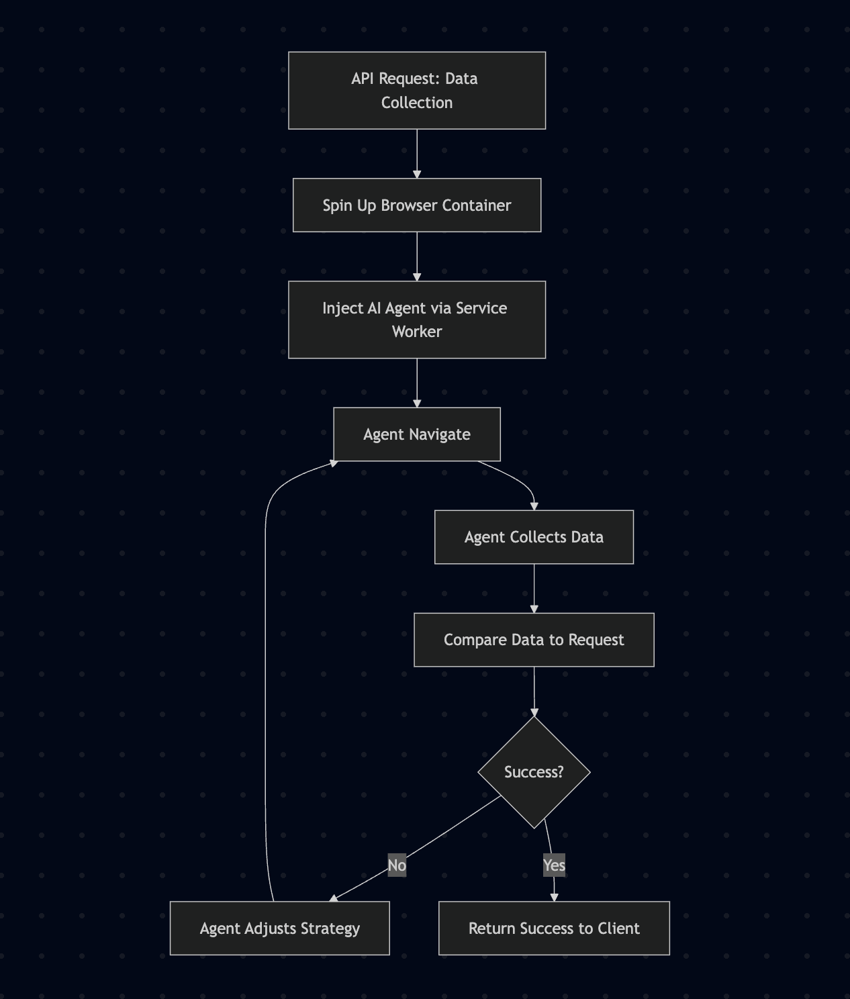

# Build Web-Automated AI Agents with Anchor Browser Agent

## Overview

Build AI agents that interact with web applications seamlessly using **Anchor Browser Agent** - a cloud-based browser automation platform. No local browser installation required - everything runs in the cloud with AI-powered interactions, session management, and proxy support.

## What You'll Learn

- **Cloud Browser Automation**: Interact with any web application without local setup
- **AI-Powered Interactions**: Build intelligent agents that understand and navigate web interfaces
- **Data Collection**: Extract structured data from dashboards and monitoring systems
- **Data Entry Automation**: Automate form submissions and data entry tasks
- **Production Deployment**: Scale web automation with session management and proxy support

## Tutorials

### **[Data Collection Guide: data_collection_guide.ipynb](./data_collection_guide.ipynb)**
Learn to collect structured data from web dashboards and applications with production-ready examples.

### **[Data Entry Guide: data_entry_guide.ipynb](./data_entry_guide.ipynb)**
Automate form submissions and data entry tasks with comprehensive code examples.

## Quick Start

1. **Sign up for Anchor Browser Agent** - Get a free account at [anchorbrowser.io](https://anchorbrowser.io?utm_source=agents-towards-production)
2. **Follow the tutorials** - Start with data collection or data entry based on your needs
3. **Use production examples** - Python and JavaScript code examples included

## Key Features

- 🌐 **Cloud-based** - No local browser installation required
- 🤖 **AI-powered** - Built-in intelligent web interactions
- 🎯 **Session Management** - Rich browser session configurations
- 🌍 **Proxy Support** - Residential/mobile proxies for geographic distribution
- 📹 **Recording** - Session recording for debugging and compliance 