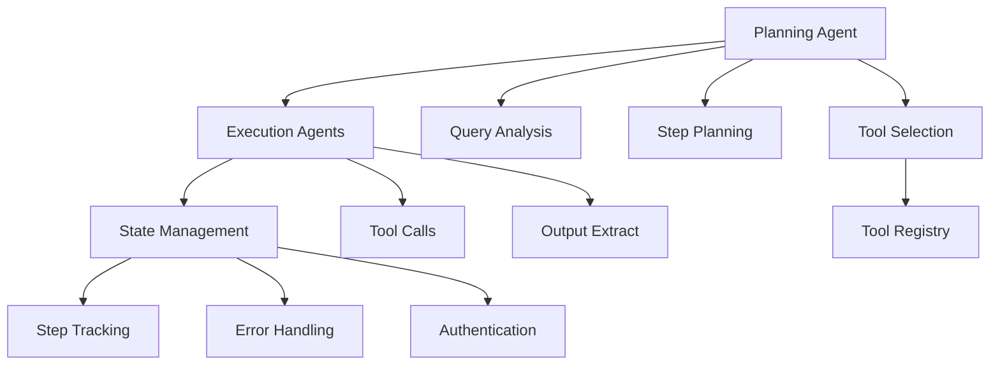

# Full-Stack Agent Applications with Portia AI

## Overview

This tutorial shows you how to use **Portia AI**, an open-source framework for building predictable, stateful, and authenticated agentic workflows. Portia AI gives you precise control over your multi-agent deployments while ensuring they're production-ready through robust state management and authentication.

You'll build an intelligent agent system that analyzes user experience research (UXR) data and automatically organizes findings in Notion. This practical example demonstrates the framework's capabilities for real-world data processing and integration tasks.

## What You'll Learn

This tutorial takes you through the fundamental concepts that make agentic workflow development effective:

### Core Concepts
- **Multi-Step Plan Generation** - Intelligent planning that breaks down complex queries into manageable steps
- **Stateful Workflow Execution** - Robust state management with error handling and progress tracking
- **Custom Tool Integration** - Seamless integration of local and cloud-based tools
- **Structured Data Outputs** - Consistent, predictable data formatting and processing
- **Cloud Service Authentication** - Secure integration with external services like Notion
- **Execution Control** - Advanced workflow management through custom hooks and monitoring

### Key Benefits
- **Production-Ready Architecture** - Build scalable, maintainable agent systems
- **Predictable Behavior** - Stateful workflows with consistent execution patterns
- **Flexible Tool Ecosystem** - Integrate any tool or service through unified interfaces
- **Real-Time Monitoring** - Comprehensive observability and debugging capabilities
- **Enterprise Security** - Built-in authentication and access control mechanisms

## Architecture Overview

Portia AI uses a multi-layered architecture that separates planning, execution, and state management:

The system uses dedicated agents for different workflow phases, ensuring robust error handling and predictable behavior. The planning agent analyzes user queries and builds multi-step execution plans, while execution agents carry out these plans while maintaining stateful information about progress and outputs.

## Tutorial Structure

### Part 1: Building Agentic Workflows
- **[portia_agents.ipynb](portia_agents.ipynb)** - Core framework concepts and UXR data analysis example
- Learn fundamental planning, execution, and state management
- Build a complete agent system that processes research data
- Integrate with external services (Notion) through authentication

### Part 2: Evaluation & Monitoring
- **[portia_evals.ipynb](portia_evals.ipynb)** - SteelThread evaluation framework
- Real-time production monitoring with Streams
- Offline evaluation and testing with Evals
- Performance insights and system optimization

