# Building Multi-Agent Systems with Coral Protocol - A Complete Development Guide

This comprehensive guide demonstrates how to construct and deploy a sophisticated multi-agent system using Coral Protocol, open-source agents, and Coral Studio for visual interaction monitoring. The tutorial walks through creating a collaborative network of specialized agents that can communicate autonomously while maintaining proper isolation and scalability.

## Understanding Multi-Agent Systems and Coral Protocol

### The Power of Distributed Agent Architectures

Multi-agent systems represent a paradigm shift from monolithic AI applications toward distributed, specialized intelligence networks. Rather than overwhelming a single agent with complex, multi-faceted tasks, this architecture allows for separation of concerns where each agent focuses on specific responsibilities and expertise areas.

Traditional single-process workflow frameworks like LangChain excel in their domain but require developers to algorithmically define inter-agent interactions. This approach, while functional, can become limiting when dealing with the nuanced, dynamic collaboration patterns that LLM-powered agents naturally excel at. The challenge lies in moving beyond rigid, function-call-based interactions toward more organic, organization-like structures where teams overlap and processes emerge naturally.

However, this agentic flexibility introduces novel production challenges including user data isolation, horizontal scalability, and system composability. These concerns become critical when transitioning from development prototypes to production-ready systems.

### Coral Protocol as Collaboration Infrastructure

Coral Protocol addresses these challenges by providing a robust collaboration infrastructure specifically designed for AI agents and production software service systems. The protocol enables agent developers to publish standardized agent advertisements that can be immediately consumed by other agents or multi-agent applications on demand.

The system leverages the Model Control Protocol (MCP) as its transport layer, facilitating seamless communication between agents and users while maintaining compatibility with any MCP-supporting agent framework. This design creates a marketplace-like ecosystem where agent developers receive incentives for usage, while application developers can dynamically compose systems from Coral's growing agent library without vendor lock-in concerns.

In this implementation scenario, you function as an application developer utilizing Coral Protocol's local development mode to assemble a multi-agent system from existing open-source components.


### Tutorial Architecture Overview

This guide establishes a three-agent collaborative system where agents communicate freely with each other and interface with users through a web-based management console. The tutorial comprehensively covers local Python agent execution from source code, multi-agent session creation, web-based agent interaction, and real-time collaboration observation through Coral Studio's monitoring capabilities.

The final section explores production deployment considerations, transitioning from development prototypes to scalable, production-ready multi-agent systems.

## Development Environment Prerequisites

### Essential Development Tools and Dependencies

Before beginning the Coral Protocol setup, your local development environment requires specific tools to support agent execution, Coral Server operations, Coral Studio interface, and external LLM integrations.

| Tool | Version | Purpose and Importance                                             |
|------|---------|-------------------------------------------------------------|
| **Python** | 3.10+ | Runtime environment for the Python-based agents used throughout this guide |
| **uv** | latest | Modern Python environment and dependency manager providing fast, reliable package management ([installation guide](https://docs.astral.sh/uv/getting-started/installation?utm_source=github&utm_medium=referral&utm_campaign=nir_github&utm_id=nir_coralprotocol)). Critical requirement: ensure UV is accessible system-wide and not bound to specific Python contexts |
| **Node.js** | 18+ | JavaScript runtime required for Coral Studio web interface execution |
| **npm** | Bundled with Node | Package manager for installing and managing Studio dependencies |
| **Git** | latest | Version control system for cloning agent repositories and Coral codebase |
| **OpenAI API Key** | Active subscription | Authentication credentials for agents utilizing OpenAI's language models |
| **Java** | 21+ | Runtime environment required for Gradle build system and Coral server execution |

### Recommended Development Tools

| Tool | Benefit |
|------|---------|
| **Visual Studio Code** | Comprehensive IDE providing excellent support for agent code editing and configuration management |

### Important Platform Considerations

**Docker Alternative**: While all components in this guide can be containerized using Docker, the tutorial focuses on local execution for enhanced development visibility and debugging capabilities. For production Docker deployments, consult the separate [Coral Docker Guide](https://docs.coralprotocol.org/CoralDoc/Introduction/CoralServerForApplications#docker-orchestration-from-inside-docker?utm_source=github&utm_medium=referral&utm_campaign=nir_github&utm_id=nir_coralprotocol).

**Windows Compatibility**: This guide currently targets Unix-like environments. Windows users should utilize Windows Subsystem for Linux (WSL) to ensure compatibility. When using WSL, execute all git operations within the WSL environment to prevent line-ending conflicts.

## Project Structure Setup and Repository Management

### Creating the Development Workspace

Begin by establishing a dedicated working directory that will contain all project components. This organized structure ensures clean separation between the Coral server, agent implementations, and configuration files.

```bash
mkdir multiagents-coral-tutorial
cd multiagents-coral-tutorial
```

### Coral Server Repository Setup

Clone the Coral server repository using the stable tutorial branch, which contains tested configurations specifically designed for this learning scenario.

```bash
git clone -b stabletutorial https://github.com/Coral-Protocol/coral-server
```

### Agent Repository Configuration

Create a dedicated agents directory and populate it with the three specialized agents that will comprise your multi-agent system. Each agent serves a distinct purpose in the collaborative network.

```bash
mkdir agents
cd agents
git clone -b stabletutorial https://github.com/Coral-Protocol/Coral-GithubMCP-Agent.git github
git clone -b stabletutorial https://github.com/Coral-Protocol/Coral-FirecrawlMCP-Agent.git firecrawl
git clone -b stable https://github.com/Coral-Protocol/Coral-Interface-Agent.git interface
```

### Verifying Project Structure

After completing the repository cloning process, your directory structure should match the following organization, which enables proper relative path resolution for agent execution.

```
multiagents-coral-tutorial/
├── coral-server/
├── agents/
│   ├── github/
│   ├── firecrawl/
│   └── interface/
├── ...
```

## Coral Server Configuration and Initialization

### Understanding Coral Server's Role

The Coral Server functions as the orchestration engine for your multi-agent ecosystem, managing session lifecycles, executing agent logic, and facilitating secure communication channels between agents. Before launching the server, you must create a comprehensive configuration file that defines agent capabilities, runtime environments, and integration parameters.

### Application Configuration File Creation

Create an `application.yaml` configuration file in the project root directory. This file defines the complete agent registry, including execution parameters, environment variables, and communication protocols.

<details>
  <summary>application.yaml</summary>

```yaml
applications:
  - id: "app"
    name: "Default Application"
    description: "Default application for testing"
    privacyKeys:
      - "priv"

registry:
  interface:
    options:
      - name: "MODEL_API_KEY"
        type: "string"
        description: "API key for the model provider"
      - name: "MODEL_NAME"
        type: "string"
        description: "What model to use (e.g 'gpt-4.1')"
        default: "gpt-4.1"
      - name: "MODEL_PROVIDER"
        type: "string"
        description: "What model provider to use (e.g 'openai', etc)"
        default: "openai"
      - name: "MODEL_MAX_TOKENS"
        type: "string"
        description: "Max tokens to use"
        default: "16000"
      - name: "MODEL_TEMPERATURE"
        type: "string"
        description: "What model temperature to use"
        default: "0.3"
      - name: "TIMEOUT_MS"
        type: "number"
        description: "Connection/tool timeouts in ms"
        default: 60000

    runtime:
      type: "executable"
      command: [ "bash", "-c", "../agents/interface/run_agent.sh ../agents/interface/main.py" ]
      environment:
        - option: "MODEL_API_KEY"
        - option: "MODEL_NAME"
        - option: "MODEL_PROVIDER"
        - option: "MODEL_MAX_TOKENS"
        - option: "MODEL_TEMPERATURE"
        - option: "TIMEOUT_MS"

  github:
    options:
      - name: "MODEL_API_KEY"
        type: "string"
        description: "API key for the model provider"
      - name: "GITHUB_PERSONAL_ACCESS_TOKEN"
        type: "string"
        description: "Github token for the service"
      - name: "MODEL_NAME"
        type: "string"
        description: "What model to use (e.g 'gpt-4.1')"
        default: "gpt-4.1"
      - name: "MODEL_PROVIDER"
        type: "string"
        description: "What model provider to use (e.g 'openai', etc)"
        default: "openai"
      - name: "MODEL_MAX_TOKENS"
        type: "string"
        description: "Max tokens to use"
        default: "16000"
      - name: "MODEL_TEMPERATURE"
        type: "string"
        description: "What model temperature to use"
        default: "0.3"
      - name: "TIMEOUT_MS"
        type: "number"
        description: "Connection/tool timeouts in ms"
        default: 300
    runtime:
      type: "executable"
      command: [ "bash", "-c", "../agents/github/run_agent.sh ../agents/github/main.py" ]
      environment:
        - option: "MODEL_API_KEY"
        - option: "GITHUB_PERSONAL_ACCESS_TOKEN"
        - option: "MODEL_NAME"
        - option: "MODEL_PROVIDER"
        - option: "MODEL_MAX_TOKENS"
        - option: "MODEL_TEMPERATURE"
        - option: "TIMEOUT_MS"

  firecrawl:
    options:
      - name: "MODEL_API_KEY"
        type: "string"
        description: "API key for the model provider"
      - name: "FIRECRAWL_API_KEY"
        type: "string"
        description: "FIRECRAWL API KEY for the service"
      - name: "MODEL_NAME"
        type: "string"
        description: "What model to use (e.g 'gpt-4.1')"
        default: "gpt-4.1"
      - name: "MODEL_PROVIDER"
        type: "string"
        description: "What model provider to use (e.g 'openai', etc)"
        default: "openai"
      - name: "MODEL_MAX_TOKENS"
        type: "string"
        description: "Max tokens to use"
        default: "16000"
      - name: "MODEL_TEMPERATURE"
        type: "string"
        description: "What model temperature to use"
        default: "0.3"
      - name: "TIMEOUT_MS"
        type: "number"
        description: "Connection/tool timeouts in ms"
        default: 300
    runtime:
      type: "executable"
      command: ["bash", "-c", "../agents/firecrawl/run_agent.sh ../agents/firecrawl/main.py"]
      environment:
        - option: "MODEL_API_KEY"
        - option: "FIRECRAWL_API_KEY"
        - option: "MODEL_NAME"
        - option: "MODEL_PROVIDER"
        - option: "MODEL_MAX_TOKENS"
        - option: "MODEL_TEMPERATURE"
        - option: "TIMEOUT_MS"
```
</details>

### Configuration Analysis

The configuration file establishes three distinct agent types, each with specialized capabilities and external service integrations. Note the relative path specifications in the `command` fields, which must align with your directory structure. If you've modified the suggested folder organization, these paths require corresponding adjustments.

### Launching the Coral Server

Navigate to the coral-server directory and start the server with the configuration path pointing to your repository root. This ensures the server loads your custom agent definitions rather than internal examples.

```bash
cd coral-server
CONFIG_PATH=../ ./gradlew run
```

This command initiates the Coral Server, which establishes the control plane for managing agent networks and facilitating their communication protocols. The server process must remain active throughout your development session, so maintain this terminal window and use additional tabs for subsequent operations.

## Coral Studio Web Interface Setup

### Understanding Coral Studio's Purpose

Coral Studio provides a comprehensive web-based interface for session management, agent monitoring, and thread visualization. This development tool enables real-time observation of agent interactions and simplified session configuration through an intuitive graphical interface.

### Studio Installation and Execution

Install and launch Coral Studio using the npx package runner, which handles dependency management automatically and ensures you receive the latest stable version.

```bash
npx @coral-protocol/coral-studio
```

This command downloads necessary dependencies and starts the Studio interface at `http://127.0.0.1:3000`. The process must remain active to maintain the web interface, so preserve this terminal session for continued access.

### Accessing the Studio Interface

Open your web browser and navigate to `http://127.0.0.1:3000` to access the Coral Studio dashboard. The interface provides comprehensive session management capabilities, agent configuration options, and real-time monitoring tools for observing multi-agent collaboration.

### Verifying Successful Installation

Confirm proper installation by verifying the presence of dashboard elements including session creation options, Coral Server connection capabilities, and visual interfaces for thread and agent observation.

## Multi-Agent Session Creation and Management

### Session Concepts and Architecture

Sessions represent the fundamental organizational unit within Coral Protocol, serving as isolated namespaces where agent graphs operate with shared context and communication channels. Analogous to Kubernetes custom resources, sessions define the complete lifecycle management for a specific collection of collaborating agents.

Production applications typically create sessions dynamically through REST API calls in response to user interactions or system events. During development, session creation through Coral Studio provides immediate visual feedback and simplified configuration management.

For comprehensive session documentation, consult the [Coral Protocol session guide](https://docs.coralprotocol.org/CoralDoc/CoreConcepts/Sessions?utm_source=github&utm_medium=referral&utm_campaign=nir_github&utm_id=nir_coralprotocol).

### Required API Credentials

The agents in this tutorial require specific API keys for external service integration. Gather these credentials before proceeding with session creation:

- **MODEL_API_KEY**: OpenAI authentication token available from [OpenAI's API key management page](https://platform.openai.com/api-keys?utm_source=github&utm_medium=referral&utm_campaign=nir_github&utm_id=nir_coralprotocol)
- **FIRECRAWL_API_KEY**: Firecrawl service token obtainable from [Firecrawl's API portal](https://www.firecrawl.dev?utm_source=github&utm_medium=referral&utm_campaign=nir_github&utm_id=nir_coralprotocol)
- **GITHUB_PERSONAL_ACCESS_TOKEN**: GitHub access token with read-only permissions, created through [GitHub's token management interface](https://docs.github.com/en/authentication/keeping-your-account-and-data-secure/managing-your-personal-access-tokens#creating-a-fine-grained-personal-access-token?utm_source=github&utm_medium=referral&utm_campaign=nir_github&utm_id=nir_coralprotocol)

### Server Connection Configuration

Begin session creation by establishing a connection to your local Coral Server through the Studio interface. Click the server selector and select 'Add a server' to configure the connection.


Enter `localhost:5555` as the host address and confirm the addition. This establishes communication between Studio and your running Coral Server instance.


### Session Initialization Process

After establishing server connectivity, create a new session by clicking 'Select session' followed by 'New session'. Configure the Application ID and Privacy Key to match your `application.yaml` configuration. Using the provided configuration file, specify `app` for Application ID and `priv` for Privacy Key.


### Agent Configuration and Tool Assignment

Configure each agent within the session by selecting 'New agent' and choosing the appropriate agent type. Begin with the 'interface' agent, which requires special configuration for user interaction capabilities.


For the interface agent specifically, add custom user input tools by navigating to the 'Custom Tools' section and selecting both 'request-question' and 'answer-question' from the dropdown menu. These tools enable direct user communication through the Studio interface.


Repeat the agent creation process for both 'github' and 'firecrawl' agents, providing the appropriate API credentials for each service during configuration.

### Agent Group Formation

Create a communication group to enable inter-agent collaboration by navigating to the 'Groups' section and clicking 'New group'. Select 'Empty group' and include all three configured agents to establish full communication capabilities between them.


### Session Export and Reusability

Consider exporting the complete session configuration using the 'Export' section to create reusable templates for future session creation. This exported JSON can be imported later to quickly recreate identical agent configurations.

### Session Activation

Complete the configuration process by clicking 'Create' to instantiate your multi-agent session. The system will initialize all agents, establish communication channels, and prepare the collaborative environment for user interaction.

```mermaid
graph LR
    subgraph group["Session"]
        interface["🖥️ Interface<br/>Agent"]
        github["🐙 GitHub<br/>Agent"] 
        firecrawl["🕷️ Firecrawl<br/>Agent"]
    end
    
    interface <--> github
    interface <--> firecrawl
    github <--> firecrawl
    
    user["👤 Coral Studio"] <--> interface
    internet["🌐 Web"] <--> firecrawl
    repos["📚 GitHub"] <--> github

    
    %% Styling
    classDef interfaceStyle fill:#10b981,stroke:#059669,stroke-width:3px,color:#fff
    classDef githubStyle fill:#6366f1,stroke:#4f46e5,stroke-width:3px,color:#fff
    classDef firecrawlStyle fill:#ef4444,stroke:#dc2626,stroke-width:3px,color:#fff
    classDef serverStyle fill:#fbbf24,stroke:#f59e0b,stroke-width:2px
    
    class interface interfaceStyle
    class github githubStyle
    class firecrawl firecrawlStyle
    class server serverStyle
```



## Interactive Agent Communication and Monitoring

### Understanding Custom Tool Integration

Coral Studio functions as the interface layer for your multi-agent system, replacing what would typically be a production application's user interface. The custom tools integrated during session creation establish bidirectional communication channels between users and agents through HTTP-based tool calls.

Examining the session creation POST request through your browser's network debugging tools reveals how custom tools are incorporated into the agent environment:

<details>
  <summary>JSON data</summary>

```json
{
  "agentGraph": {
    "agents": {
      "interface": {
        "options": {
          "MODEL_API_KEY": "..."
        },
        "type": "local",
        "agentType": "interface",
        "tools": [
          "user-input-respond",
          "user-input-request"
        ]
      },
      "github": {
        "options": {
          "MODEL_API_KEY": "...",
          "GITHUB_PERSONAL_ACCESS_TOKEN": "..."
        },
        "type": "local",
        "agentType": "github",
        "tools": []
      },
      "firecrawl": {
        "options": {
          "MODEL_API_KEY": "...",
          "FIRECRAWL_API_KEY": "..."
        },
        "type": "local",
        "agentType": "firecrawl",
        "tools": []
      }
    },
    "links": [
      [
        "firecrawl",
        "github",
        "interface"
      ]
    ],
    "tools": {
      "user-input-respond": {
        "transport": {
          "type": "http",
          "url": "http://localhost:5173/api/mcp-tools/user-input-respond"
        },
        "toolSchema": {
          "name": "answer-question",
          "description": "Answer the last question you requested from the user. You can only respond once, and will have to request more input later.",
          "inputSchema": {
            "type": "object",
            "properties": {
              "response": {
                "type": "string",
                "description": "Answer to show to the user."
              }
            },
            "required": [
              "response"
            ]
          }
        }
      },
      "user-input-request": {
        "transport": {
          "type": "http",
          "url": "http://localhost:5173/api/mcp-tools/user-input-request"
        },
        "toolSchema": {
          "name": "request-question",
          "description": "Request a question from the user. Hangs until input is received.",
          "inputSchema": {
            "type": "object",
            "properties": {
              "message": {
                "type": "string",
                "description": "Message to show to the user."
              }
            }
          }
        }
      }
    }
  }
}
```
</details>

The `tools` object demonstrates how custom HTTP-based tools are mapped to specific endpoints within Coral Studio, enabling seamless integration between agent logic and user interface components.

### Responding to Agent Queries

Once your session becomes active, each agent initializes and begins its operational loop, establishing communication channels and preparing for collaborative tasks. The interface agent, when ready to interact, calls the 'request-question' tool, triggering a notification in the Studio interface.

Navigate to the 'Tools > User Input' tab in the sidebar to access pending agent queries and provide responses. This interface serves as the primary communication channel between users and the agent network.


After submitting your response through the interface, the blocking tool call resolves, allowing the interface agent to continue its operational cycle. The agent processes the input, potentially collaborates with other agents, and either requests additional information or provides final responses through the 'answer-question' tool.

### Observing Real-Time Agent Collaboration

Monitor agent collaboration and communication patterns by accessing the thread visualization interface. Select your active session, expand the "Threads" section, and click into individual threads to observe detailed interaction flows.


This view provides comprehensive visibility into how agents coordinate their efforts, share information, and collectively work toward fulfilling user requests. The interface agent utilizes the 'answer-question' tool when satisfied with the collaborative response, completing the interaction cycle.

### Development Iteration and Customization

The source-based execution model enables rapid development iteration through direct code modification. Since agents run from source code in the `agents` directory, you can modify their behavior, add new capabilities, or adjust collaboration patterns by editing the agent implementations directly.

For accelerated development workflows, explore [Devmode](https://docs.coralprotocol.org/CoralDoc/Introduction/UsingAgents#devmode?utm_source=github&utm_medium=referral&utm_campaign=nir_github&utm_id=nir_coralprotocol) documented in the Coral Protocol documentation, which provides enhanced development tools and faster iteration cycles.

### Expanding the Agent Network

Add new agents to your system by following a straightforward expansion process. Clone additional agent repositories into your `agents` directory, update the `application.yaml` configuration to include the new agent definitions, and modify your session creation requests to incorporate the new agents into the collaborative graph.


## Production Deployment Considerations

### Runtime Environment Transition

The development environment utilizes the Executable runtime for immediate source code execution, providing excellent visibility for debugging and rapid iteration. Production deployments require more robust runtime environments that ensure isolation, scalability, and security.

The Docker runtime represents the recommended production approach, replacing source code paths with containerized images. Detailed Docker implementation guidance is available in the [Coral Protocol Docker documentation](https://docs.coralprotocol.org/CoralDoc/Introduction/CoralServerForApplications#docker-recommended?utm_source=github&utm_medium=referral&utm_campaign=nir_github&utm_id=nir_coralprotocol). This transition involves configuring Coral Server to interact with the Docker daemon for container-based agent execution during session instantiation.

### Backend Service Architecture

Production multi-agent systems typically feature backend services that manage session lifecycles and interface with Coral Server through its REST API endpoints. Coral Protocol imposes no architectural constraints on backend implementation, supporting any programming language or framework through standard HTTP communication patterns.

The deployment architecture requires Coral Server instances to operate alongside backend services within the same network namespace. In Kubernetes environments, this involves creating Services that route traffic to Coral Server pods while ensuring these instances remain isolated from public internet access. Coral Servers require Docker socket access for container-based agent execution, necessitating appropriate volume mounts in containerized deployments.

Future releases will include Kubernetes-native runtimes and additional deployment options. Monitor the [Coral Server GitHub repository](https://github.com/Coral-Protocol/coral-server?utm_source=github&utm_medium=referral&utm_campaign=nir_github&utm_id=nir_coralprotocol) for updates on these enhanced deployment capabilities.

### Frontend Integration Strategies

Frontend implementation enjoys complete flexibility, with no restrictions on frameworks, libraries, or architectural patterns. However, production frontends should never communicate directly with Coral Server instances. Instead, establish proper architectural boundaries where frontends interact exclusively with backend services, which subsequently manage Coral Server communication.

Coral Studio serves as a development and debugging tool with its own integrated backend service, designed for private network operation where Coral Server access is secure and controlled. Production systems require purpose-built frontend solutions that respect security boundaries and user experience requirements specific to your application domain.
